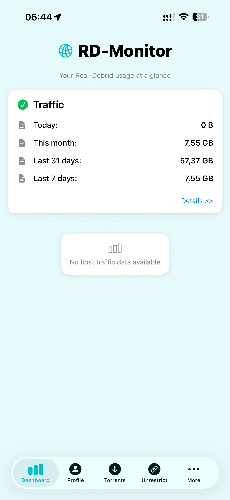
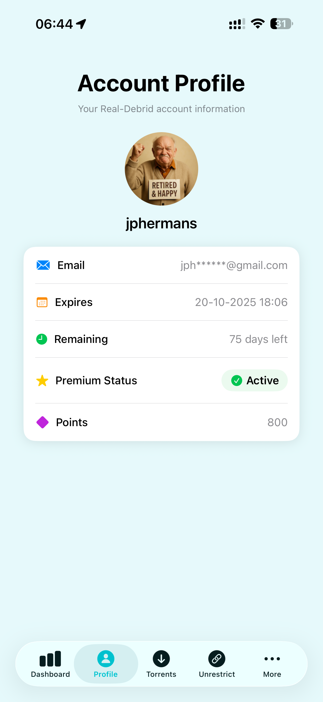
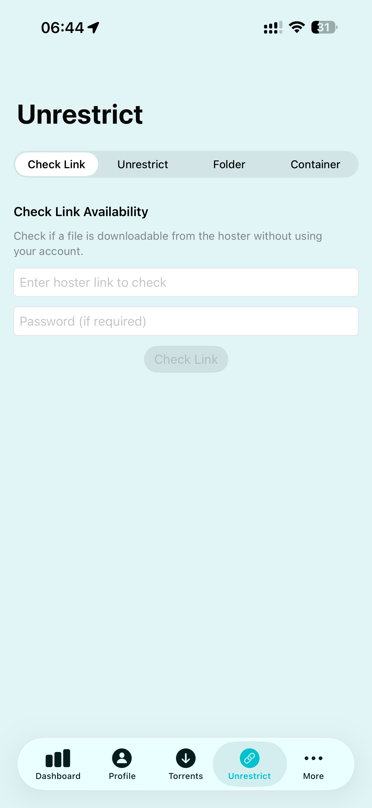

// 🚀 RD-Monitor

//   

// ---

// 

//   
// 

// <h2 align="center">✨ Real-Debrid Account & Traffic Monitor ✨</h2>

// Monitor your <b>Real-Debrid</b> account, track your premium traffic, and manage your downloads in style! 
// All in a modern and colorful SwiftUI app for iOS.

// ---

// ## 🌈 Features

// - 📊 <b>Dashboard:</b> Beautiful traffic breakdown and usage charts
// - 👤 <b>Account Profile:</b> Inspect your account status, expiration, and points
// - 🔗 <b>Unrestrict Links:</b> Instantly generate direct download links from hosters
// - 📁 <b>Folder & Container Decrypt:</b> Extract links from folders or container files (.dlc, .ccf, .rsdf)
// - 🧪 <b>Demo Mode:</b> Explore the app with no account required
// - 🌓 <b>Light & Dark Mode:</b> Adaptive, modern interface
// - 🛡️ <b>Privacy:</b> Your API key is securely stored on-device

// ---

// ## 📸 Screenshots

// 

//   <!-- Replace these links with your real app screenshots -->
//   
//   
//   
//    
//   <i>Dashboard · Account Profile · Unrestrict Tool</i>
// 

// ---

// ## 🚦 Quick Start

// 1. <b>Clone the repo</b> and open in Xcode 15+
// 2. <b>Build & Run</b> on iOS 18+ (simulator or device)
// 3. <b>Enter your Real-Debrid API Key</b> in Settings
// 4. <b>Explore your traffic, account, and more!</b>

// ---

// ## 🛠️ Built With

// - 🐦 <b>Swift 6</b> & <b>SwiftUI</b>
// - 📊 <b>Swift Charts</b> for rich visualizations
// - 🌐 <b>Async Networking</b> with URLSession
// - ☀️ <b>Adaptive Color & Dark Mode</b>

// ---

// ## 🙌 Credits

// Made by <b>Jean-Pierre Hermans</b>. 
// Inspired by the Real-Debrid API and a love for elegant user interfaces.

// ---

// ## 📄 License

// This app is provided under the MIT License. See [LICENSE](LICENSE) for details.

// ---

// 
💙 Enjoy using <b>RD-Monitor</b>! 🚀

